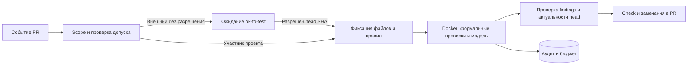

# Рекомендации по архитектуре

Заказчик прочитал исходные требования без возражений. Схема обновления CI
в D-09 явно согласована 8 октября 2026 года. Прочие пункты описывают
предложенную архитектуру; незаданные параметры перечислены в открытых вопросах.

## D-01. Развивать ydbdoc-review-ng

Требования нового режима хранить в `DOC_REVIEW_REQUIREMENTS_RU.md`, знания
в `knowledge/doc-review/`, код в отдельном `policy_review/`. Общие адаптеры
переиспользовать после проверки контрактов. Так требования к переводам
не смешиваются с требованиями к документационному ревью, а интеграция
с Yandex/GitHub/YDB и выпуском пакета остаётся общей.

Отдельная новая code repo оправдана, если команда хочет независимых
владельцев, release cycle и secrets. Тогда общие адаптеры следует вынести
в версионированный пакет. Копирование runtime создаст два места исправления
ошибок биллинга и моделей. Отдельная knowledge repo имеет смысл при
независимом процессе согласования; потребуется pin её версии в каждом запуске.

## D-02. Разделить допуск, анализ и публикацию

В ydb нужен небольшой consumer workflow. Анализ выполняет доверенный образ.
Публикация получает минимальные GitHub write permissions отдельно от
модельного процесса. Snapshot текстов PR не является источником исполняемого кода.

## D-03. Разрешение на конкретный SHA

Хранить проверенный label event и head. Это устраняет зависимость от удаления
`ok-to-test` другим CI и не распространяет разрешение на новые непроверенные
коммиты внешнего автора. Возможное постоянное доверие на PR требует явного решения.

## D-04. Полный контекст, замечания по изменению

Читать целиком изменённую страницу, связанные includes и нужный справочный
контекст. Публиковать введённые PR проблемы; прежние отделять. Причины:
правила о введении, определениях и структуре не проверяются одним diff,
а полный список старых нарушений затрудняет работу автора маленькой правки.
Утвердить, нужна ли вместо этого полная ревизия каждой изменённой статьи.

## D-05. Один источник правил и доверенный rules SHA

Policy плюс полный набор нормативных файлов из доверенной base revision.
В knowledge нет редактируемой копии. Изменение правил в PR анализируется
как изменение данных и не даёт PR права изменить runtime policy.

## D-06. Лимит на каждую попытку модели

У существующего audit/pricing сохранить формат usage/cost, но добавить
проверку и резерв бюджета перед каждой HTTP-попыткой, включая client retries.
Контроль только между верхнеуровневыми вызовами оставляет retry без лимита.
До доказательства точной верхней границы говорить об ограничении будущих
запросов и остаточном риске уже начатой генерации, а не о гарантии provider cancellation.

## D-07. Информационный пилот

Начать с suggestions и общего отчёта, без автоматических коммитов и
обязательного merge gate. Затем измерить ложные срабатывания на согласованном
корпусе. Решение об автоисправлениях особенно важно из-за GENERAL_RULES.

## D-08. Явная неполнота

Для каждого правила фиксировать coverage. Визуальная консистентность,
отсутствующий технический контекст, превышение бюджета и scope limits
не должны приводить к ложному «проверка пройдена». Особенно проверить
правило 13, для которого текущего текстового адаптера недостаточно.

## D-09. Обновлять ревьювер передвижением постоянного тега

Согласовано заказчиком 8 октября 2026 года. Основание: изменения consumer CI
в ydb долго проходят согласование; новые коммиты ревьювера должны попадать
в следующий запуск переносом тега в репозитории реализации.

В consumer workflow ссылка на action имеет постоянный тег, например
`doc-review-stable`. Consumer не содержит фиксацию action SHA или image
digest, требующую правки при каждом выпуске. Этот пункт заменяет исходную
рекомендацию фиксировать action по SHA в consumer CI.

Образ публикуется до переноса тега; коммит action связывает свою версию
с соответствующим образом. Digest допустимо фиксировать внутри обновляемого
action. Переносить два независимых тега action/image без согласования версии
не требуется. В аудит каждого запуска записывать фактические action SHA
и image digest; выбранная версия не меняется в процессе работы.
Откат: перенос того же тега на предыдущий рабочий коммит.

Точные имя тега и registry path определяются при внедрении. Решение касается
версии исполняемого ревьювера. Head SHA проверяемого PR, версия правил и
исследовательские ссылки по-прежнему фиксируются для конкретного запуска.
